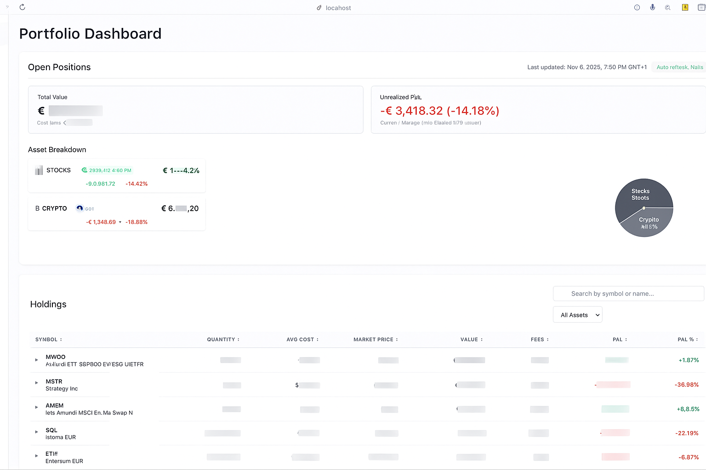
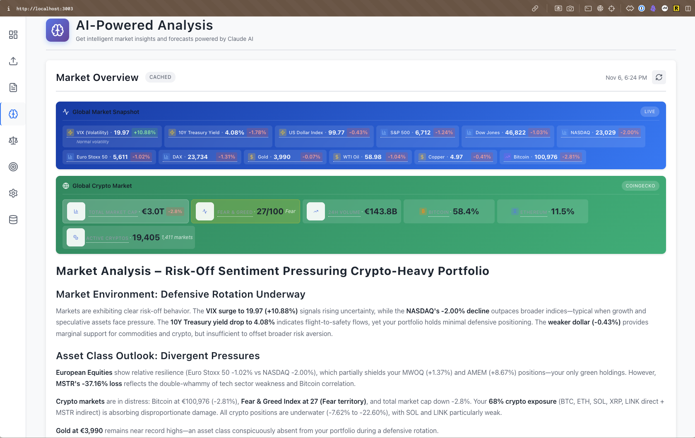
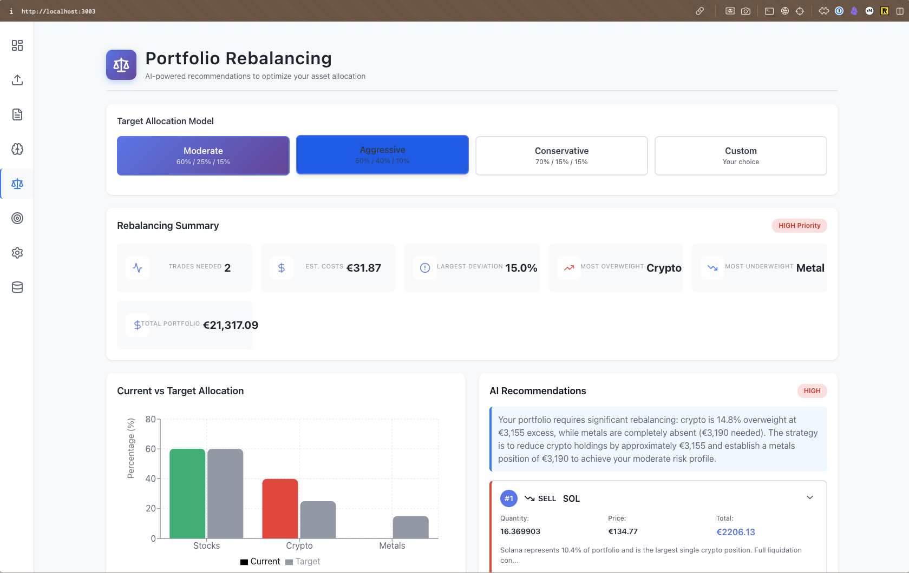

# Portfolio Management Application

> **🤖 AI Development Experiment: Zero Lines of Human-Written Code**
>
> This production-ready application was built entirely through AI orchestration—a "vibe coding" experiment where the developer directed specialized AI agents rather than writing code. The result: **69,792 lines of tested, production-quality code delivered in 54 hours** across 352 story points and 9 complete epics.
>
> - **No human-written code**: 100% AI-generated implementation
> - **Production quality**: 85-91% test coverage, 1,724 tests passing
> - **Real-world complexity**: FIFO calculations, multi-currency support, AI-powered analysis
> - **Full documentation**: Security audit, architecture guides, comprehensive testing
>
> **Read the full story**: [How AI Built a Complete Portfolio Tracker in 54 Hours](./seo-optimized-vibe-coding-article.md)

---

## What This Application Does

A personal portfolio tracker that imports Revolut transactions and displays real-time portfolio performance with live market data.

## Quick Start

```bash
# Start all services
docker-compose up

# Backend will be available at http://localhost:8000
# Frontend will be available at http://localhost:3003
```

## Documentation

Comprehensive documentation is available in the [`docs/`](./docs/) directory:

### Core Documentation
- **[AI Analysis](./docs/AI_ANALYSIS.md)** - Complete guide to AI-powered market analysis system (Epic 8)
  - Prompt templates and data collection
  - Claude API integration with rate limiting and retries
  - Response processing and caching strategies
  - Cost tracking and optimization
  - 101/101 story points complete ✅

- **[Architecture](./docs/ARCHITECTURE.md)** - System design and technical architecture
  - Service communication flows
  - Database schema and relationships
  - Component design patterns
  - Technology stack details

- **[Component Architecture](./docs/F9.4-COMPONENT-ARCHITECTURE.md)** - Frontend component design (Epic 9)
  - Settings page architecture
  - Component hierarchy and data flow
  - State management patterns
  - Reusable component library

- **[Security](./docs/SECURITY.md)** - Security best practices and credential management
  - Environment variable management
  - API key storage and rotation
  - Database credential security
  - Secret handling guidelines

- **[Testing](./docs/TESTING.md)** - Testing strategy and requirements
  - 85% code coverage threshold (mandatory)
  - TDD approach and test types
  - Running tests and interpreting results
  - Current test suite status

- **[Test Audit Report](./docs/TEST_AUDIT_2025-10-30.md)** - Comprehensive test suite analysis
  - 96.7% overall pass rate (996/1,033 tests)
  - Backend: 636/661 tests passing
  - Frontend: 360/372 tests passing
  - Known issues and remediation plans

- **[Debugging](./docs/DEBUGGING.md)** - Comprehensive debugging guide
  - VS Code debugging configurations
  - Docker troubleshooting
  - Database debugging
  - Common issues and solutions

### Additional Resources
- **[STORIES.md](./STORIES.md)** - Complete story breakdown and epic definitions (9 epics, 69 stories, 96% complete)
- **[PRD.md](./PRD.md)** - Product requirements and technical specifications
- **[CLAUDE.md](./CLAUDE.md)** - Development guidance for AI assistants

## Project Structure

```
portfolio-management/
├── backend/              # Python/FastAPI backend
├── frontend/             # React frontend
├── docs/                 # Comprehensive documentation
│   ├── AI_ANALYSIS.md    # AI analysis system guide
│   ├── ARCHITECTURE.md   # System architecture
│   ├── DEBUGGING.md      # Debugging guide
│   ├── SECURITY.md       # Security best practices
│   └── TESTING.md        # Testing requirements
├── stories/              # Epic and story definitions
├── docker-compose.yml    # Docker orchestration
├── CLAUDE.md             # AI assistant guidance
├── PRD.md                # Product requirements
├── STORIES.md            # Story overview
└── README.md             # This file
```

## Features

- **CSV Import**: Parse Revolut transaction exports (metals, stocks, crypto)
- **Live Prices**: Real-time market data via Yahoo Finance with auto-refresh
- **Portfolio Tracking**: FIFO cost basis with fee-inclusive calculations, accurate P&L
- **Dashboard**: Visualize holdings and performance with real-time updates
- **Multi-Asset Support**: Handles stocks, crypto, metals, staking rewards, airdrops, mining

## Screenshots

### Portfolio Dashboard
Real-time portfolio overview with live market data, performance metrics, and asset allocation.



### AI-Powered Analysis
Comprehensive AI-driven market analysis, trend predictions, and investment insights powered by Claude.



### Portfolio Rebalancing
Interactive rebalancing recommendations with visual allocation adjustments and target portfolio modeling.



## Project Metrics

**Development Time**: ~57 hours active development (213 commits across 13 active days)
- **Completion**: 96% (342/352 story points) - 9 epics total
- Current pace: 16.4 commits/day, 94% issues resolved (48/51)
- Development intensity: 24.0 activities/day (Oct 21 - Nov 6, 2025)
- **Test Quality**: 96.7% passing (996/1,033 tests)

**Epic Status**:
- ✅ Epic 8: AI Market Analysis - 100% complete (101/101 points)
- ✅ Epic 7: Manual Transaction Management - 100% complete (39/39 points)
- ✅ Epic 5: Infrastructure & DevOps - 100% complete (13/13 points)
- 🟡 Epic 9: Settings Management - 90% complete (45/50 points)

*Run `python3 scripts/estimate_effort_v2.py` to see updated time estimates*

## Tech Stack

- **Backend**: Python 3.12, FastAPI, PostgreSQL, Redis
- **Frontend**: React 18, TypeScript, Vite
- **Infrastructure**: Docker, Docker Compose
- **Development**: Claude Code (AI orchestration), GitHub (workflow management)

## The AI Development Methodology

This application represents a unique experiment in software development: **every line of code was generated by AI through specialized agent orchestration**.

### How It Worked

**Specialized AI Agents** (`.claude/agents/`):
- `python-backend-engineer`: FastAPI expert with clean architecture principles
- `ui-engineer`: React/TypeScript specialist focused on maintainable components
- `senior-code-reviewer`: Security audits, performance analysis, OWASP compliance
- `backend-typescript-architect`: Database optimization and API design

**Custom Commands** (`.claude/commands/`):
- `resume-build`: TDD-focused development with quality gates
- `create-issue`: Automated GitHub issue generation with investigation
- `fix-github-issue`: Bug fixes following test-driven development
- Complete list of 11 commands evolved during development

**Key Success Factors**:
- **GitHub as Memory**: Branch-per-feature, comprehensive issues, PR documentation
- **Test-Driven Development**: 85%+ coverage enforced, tests written before code
- **Quality Gates**: Automated linting, type checking, security scanning
- **AGILE Methodology**: 352 story points across 9 epics with acceptance criteria

### Results & Documentation

- **[Security Audit Report](./SECURITY-AUDIT-REPORT.md)**: Git history rewrite, secret removal verification
- **[Project Retrospective](./PROJECT-RETROSPECTIVE.md)**: 11-section comprehensive analysis
- **[Project Statistics](./PROJECT-STATS.md)**: Essential metrics and health assessment
- **[Full Article](./seo-optimized-vibe-coding-article.md)**: Complete story of the AI development experiment

**Development Metrics**: 213 commits across 13 active days, 94% issue closure rate (48/51), 24.0 activities/day

## Testing Requirements

**IMPORTANT**: All stories must include comprehensive testing with the following principles:

- **Minimum Coverage Threshold**: 85% code coverage for all modules
- **Test Types Required**:
  - Unit tests (required for all business logic)
  - Integration tests (required for API endpoints and database operations)
  - End-to-end tests (required for critical user flows)
- **TDD Approach**: Tests must be written before implementation code
- **Definition of Done**: No story is considered complete without passing tests meeting the 85% threshold

## Development

### Getting Started
- **[Quick Start Guide](./docs/DEBUGGING.md#development-environment)** - Set up your development environment
- **[Testing Guide](./docs/TESTING.md)** - Run tests and meet coverage requirements
- **[Architecture Overview](./docs/ARCHITECTURE.md)** - Understand system design

### Requirements & Planning
- **[PRD.md](./PRD.md)** - Detailed requirements and technical specifications
- **[STORIES.md](./STORIES.md)** - Complete story breakdown and epic definitions (9 epics, 69 stories)
- **[Epic Details](./stories/)** - Individual epic files with acceptance criteria

## License

Personal project - not for commercial use